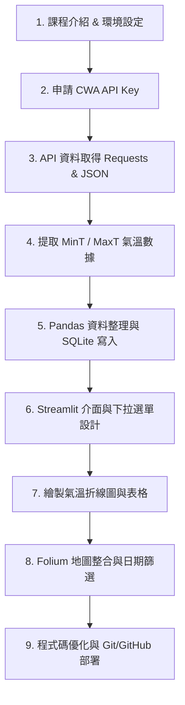

# ⛅ 台灣天氣預報互動應用系統 (Taiwan Weather Forecast Dashboard)

> **AI 創新微課程專案** | **CWA API × JSON × Python × SQLite × Streamlit × Folium**  
> *Code Smarter, Build a Better Tomorrow! 用程式探索天氣，用資料看見台灣，用 AI 實現更多可能！*


---

## 📌 專案簡介 (Project Overview)

本專案旨在運用 **Python** 結合中央氣象署（CWA）Open Data API 串接台灣各地區一週天氣預報資料，經過 **JSON 資料解析與整理（ETL）**後儲存至 **SQLite 資料庫**，並透過 **Streamlit Web 介面** 與 **Folium 地圖** 打造高互動性的台灣氣象動態儀表板（Taiwan Weather Dashboard）。

本專案採用 **Vibe Coding (AI-Assisted Development)** 流程開發，整合 **Antigravity IDE × Gemini 2.0 × GitHub** 實現高速迭代與版本控制。

---

## 🔥 核心功能特色 (Features)

1. **🌐 CWA API 自動串接與 JSON 解析**
   - 自動發送 HTTP API 請求取得中央氣象署最新預報。
   - 解析結構化 JSON 內容，提取 `MinT`（最低氣溫）與 `MaxT`（最高氣溫）關鍵資料。

2. **💾 結構化 SQLite 資料庫管理 (`data.db`)**
   - 自動建立 `TemperatureForecasts` 資料表。
   - 提供高效 SQL 查詢機制與資料重複性驗證，保持資料清潔。

3. **📊 互動式氣象儀表板 (Streamlit Web App)**
   - **地區下拉選單**：支援「北部地區、中部地區、南部地區、東部地區、東北部地區、東南部地區」快速切換。
   - **一週氣溫折線圖**：即時繪製最高溫與最低溫變化趨勢。
   - **數據表格展示**：清晰呈現日期與氣溫分佈。

4. **🗺️ 台灣地圖空間視覺化 (Folium + Streamlit)**
   - **互動式地圖**：提供全台氣溫地圖與各分區氣溫標籤。
   - **日期篩選器**：選擇特定日期，動態呈現該日全台氣溫變化。

5. **🤖 AI 賦能與靈活擴充 (Vibe Coding)**
   - 代碼結構清晰、優良模組化設計（含異常處理機制與詳細註解）。
   - 易於延伸至 Line Bot 天氣提醒、旅遊行程建議、智慧農業與防災應對。

---

## 🏗️ 專案架構 (Project Structure)

```text
├── .gitignore               # Git 忽略檔案設定
├── README.md                # 專案說明文件
├── requirements.txt         # 套件依賴清單
├── cwa_service.py           # CWA API 抓取與 JSON 解析模組
├── db_manager.py            # SQLite 資料庫讀寫模組
├── app.py                   # Streamlit 主程式 (含介面與 Folium 地圖)
└── data.db                  # SQLite 本地資料庫 (自動產生)
```

---

## 📊 資料庫設計 (Database Schema)

資料庫名稱：`data.db`  
資料表名稱：`TemperatureForecasts`

| 欄位名稱 (Field) | 資料型態 (Type) | 說明 (Description) |
| :--- | :--- | :--- |
| `id` | `INTEGER PRIMARY KEY AUTOINCREMENT` | 主鍵 / 紀錄編號 |
| `regionName` | `TEXT` | 地區名稱 (如: 北部地區、中部地區) |
| `dataDate` | `TEXT` | 預報日期 (Format: YYYY-MM-DD) |
| `mint` | `REAL` | 當日預測最低氣溫 (°C) |
| `maxt` | `REAL` | 當日預測最高氣溫 (°C) |

---

## 🚀 快速上手指南 (Quick Start)

### 1. 複製儲存庫 (Clone Repository)
```bash
git clone https://github.com/a9110118888/AIOT-L3_hw.git
cd AIOT-L3_hw
```

### 2. 安裝必要套件 (Install Dependencies)
建議建立 Python 虛擬環境 (`venv`) 後執行：
```bash
pip install -r requirements.txt
```

### 3. 設定 CWA API Key (Set API Key)
前往 [中央氣象署開放資料平臺](https://opendata.cwa.gov.tw/) 註冊並取得 Authorization API Key。  
在專案目錄下設定環境變數或於 `cwa_service.py` 中填入你的 API Key。

### 4. 啟動 Streamlit 應用程式 (Run Web App)
```bash
streamlit run app.py
```
執行後請打開瀏覽器造訪：`http://localhost:8501`

---

## 🗺️ 學習學習地圖 (24-Step Roadmap)



---

## 💡 未來延伸應用 (Future Roadmap)

- [ ] **Line Bot 智慧通知**：每日自動定時推播氣溫特報與降雨提醒。
- [ ] **智慧農業 / 防災應用**：根據低溫與暴雨特報啟動自動化防災建議。
- [ ] **AI 預測分析**：結合 LLM (Gemini / OpenAI) 產生個人化穿搭與旅遊規劃建議。

---

## 👨‍💻 貢獻者與導師 (Credits & Acknowledgments)

- **指導導師**：煥哥 (Huan Ge)
- **開發工具**：Antigravity IDE × Gemini AI Agent
- **資料來源**：[中央氣象署 Open Data 平台](https://opendata.cwa.gov.tw/)

> *技術可以解決問題，但更重要的是：用技術創造更好的未來！ — 煥哥*
